# 项目宪法 (`PRD.md`)

## 1. 文档目的
本文档是 **InsurDash** 应用的最高设计蓝图与最终信息源，是指导项目所有架构决策、逻辑实现、以及文档系统一致性的“宪法”。它旨在为所有项目参与者提供一个关于应用目标、核心原则和模块交互的宏观、统一的视图。

## 2. 文档哲学：自愈式文档系统
本项目采用一套**自愈式文档系统 (Self-Healing Documentation System)**，以确保文档始终与代码的最新状态保持同步。

- **`PRD.md` (本文档)**: 项目的**宪法**。它定义了全局规则、设计原则、和宏观上下文。所有模块都必须遵循本文档的规定。
- **`docs/*.md`**: 项目的**构建基石**。每个模块都拥有一个独立的、详尽的文档，描述其内部实现细节。
- **AI 守护者 (AI Guardian)**: 作为本项目的AI助手，我的核心职责之一是维护此文档系统。在处理任何代码变更请求时，我都会强制执行文档的同步更新，并审核变更是否与本宪法的原则相冲突。

## 3. 核心价值与范围
InsurDash 是一个安全、交互式、高性能的车险经营分析仪表盘，专为业务分析师和管理层设计。其核心价值在于提供深度的数据可视化分析能力，并通过先进、安全的架构，确保在全球范围内的快速、稳定访问。

## 4. 关键术语
| 术语 | 英文/ID | 定义 |
| :---- | :---- | :---- |
| **API路由** | API Route | Next.js中用于构建后端API的功能，它运行在安全的服务器环境。 |
| **BFF** | Backend for Frontend | 一种架构模式，创建一个专为前端应用服务的后端代理层，提升安全性。 |
| **PoP** | Period over Period | 环比分析模式，分析“当周发生额”。 |
| **YTD** | Year To Date | 本年迄今累计值。 |
| **活文档** | Living Documentation | 指始终与代码最新状态保持同步的核心项目文档 (如本文档)。 |

## 5. 系统架构
### 5.1. 技术栈
- **前端**: Next.js (App Router, 动态渲染模式), TypeScript, ShadCN UI, Tailwind CSS
- **图表**: Recharts
- **后端 & 数据库**: Supabase (Postgres, Auth)
- **部署**: Cloudflare Pages (通过 GitHub Actions 自动部署)

### 5.2. 数据流架构 (BFF 模式)
本应用采用**后端代理 (BFF)** 模式，以实现最高的安全性。

```mermaid
graph TD
    subgraph "全球用户访问"
        User[👩‍💼 用户浏览器]
    end
    subgraph "Cloudflare 全球边缘网络"
        Pages[🌍 Cloudflare Pages]
        ApiRoute[🔒 API路由 @ /api/auth/login]
    end
    subgraph "BaaS 后端服务"
        Supabase[☁️ Supabase 生产实例]
    end

    User -- "1. 访问应用" --> Pages
    User -- "2. 登录请求" --> ApiRoute
    ApiRoute -- "3. 服务器间安全认证" --> Supabase
    ApiRoute -- "4. 返回安全凭证" --> User
    User -- "5. 凭证直接查询数据" --> Supabase

    style ApiRoute fill:#F38020,stroke:#fff,stroke-width:2px,color:#fff
```

**流程解读**:
用户的登录请求不会直接发送到Supabase。它会先到达我们应用自己的API路由。这个路由在安全的服务器环境中运行，它代表用户向Supabase发起认证，然后将获取到的安全凭证(Session)返回给浏览器。这确保了敏感的认证过程永远不会暴露在前端。

### 5.3. 核心数据模型
- **数据源**: Supabase Postgres `business_data` 视图。
- **核心结构**: 每行代表一个业务线在一个周期内的YTD累计数据快照。
- **关键字段**: `period_id`, `business_type`, `premium_written`, `premium_earned`, `total_loss_amount`, `claim_count`, `expense_amount_raw`, `avg_premium_per_policy`。

## 6. 全局UI与设计系统
- **颜色系统**: 应用中的颜色是传递信息的关键工具。
  - **动态风险色**: 基于业务线的“变动成本率”(VCR)动态计算，从健康的绿色到高风险的红色/紫红色，应用于所有图表的条形、气泡等元素。
  - **绩效指示色**: 在KPI卡片中，用绿色代表积极变化（利润增长、成本下降），红色代表负面变化。
- **布局**: 采用自上而下的信息架构。顶部为固定的导航栏和全局筛选器，下方为可滚动的主内容区（KPI看板、图表区、数据表）。
- **字体与间距**: 遵循 `tailwind.config.ts` 和 `globals.css` 中定义的规范，确保视觉一致性。

## 7. 核心功能模块 (F-REQ)
以下是本项目核心功能模块的清单。每个模块的详细设计、实现逻辑和维护指南，均记录在其专属的文档中。

### 核心引擎
- **F-REQ-01: 认证 (Authentication)**: 负责用户登录、登出和会话管理。
  - *详见模块文档: [[docs/authentication.md]]*
- **F-REQ-02: 数据获取与处理 (Data Pipeline)**: 负责从Supabase获取原始数据，并执行所有KPI计算。
  - *详见模块文档: [[docs/data-pipeline.md]]*
- **F-REQ-03: 全局状态管理 (Dashboard Context)**: 负责整个仪表盘的共享状态。
  - *详见模块文档: [[docs/dashboard-context.md]]*

### 全局UI与布局
- **F-REQ-04: 主应用外壳 (Main Application Shell)**: 应用的整体布局、导航栏和页面结构。
  - *详见模块文档: [[docs/app-shell.md]]*
- **F-REQ-05: 全局筛选器 (Global Filters)**: 负责所有图表和数据的联动筛选。
  - *详见模块文档: [[docs/global-filters.md]]*

### 功能模块
- **F-REQ-06: KPI核心指标看板 (KPI Grid)**: 以4x4网格展示16个核心指标卡片。
  - *详见模块文档: [[docs/kpi-grid.md]]*
- **F-REQ-07: 详细数据表 (Detailed Data Table)**: 页面底部的可排序、可折叠数据表。
  - *详见模块文档: [[docs/data-table.md]]*
- **F-REQ-08: AI辅助分析 (AI Analysis Helper)**: 生成结构化文本以供外部LLM分析。
  - *详见模块文档: [[docs/ai-helper.md]]*

### 图表子模块
- **F-REQ-09: 图表 - 趋势分析 (Chart - Trend Analysis)**: 追踪单个指标在时间序列上的绝对值与增长率。
  - *详见模块文档: [[docs/chart-trend.md]]*
- **F-REQ-10: 图表 - 贡献度分析 (Chart - Contribution Analysis)**: 对比两个指标的当周贡献度变化趋势。
  - *详见模块文档: [[docs/chart-contribution.md]]*
- **F-REQ-11: 图表 - 占比分析 (Chart - Ratio/Donut Analysis)**: 通过双环饼图对比业务构成。
  - *详见模块文档: [[docs/chart-ratio.md]]*
- **F-REQ-12: 图表 - 业务分布 (Chart - Ranking Analysis)**: 按指定KPI对业务线进行排名可视化。
  - *详见模块文档: [[docs/chart-ranking.md]]*
- **F-REQ-13: 图表 - 多维气泡图 (Chart - Bubble Chart)**: 在一个视图中同时展示三个KPI维度。
  - *详见模块文档: [[docs/chart-bubble.md]]*
- **F-REQ-14: 图表 - 帕累托分析 (Chart - Pareto Analysis)**: 进行经典的“二八法则”分析。
  - *详见模块文档: [[docs/chart-pareto.md]]*

## 8. 部署与复刻 (Deployment & Replication)
本指南提供了从零开始设置、运行和部署应用的**最终、经过验证的生产方案**。

### 8.1. 云端基础设施初始化
1.  **Supabase 设置**:
    *   创建 Supabase 项目，并获取 **Project URL** 和 anon **public key**。
    *   开启并配置**行级安全策略 (RLS)**，例如：只允许已登录的用户读取。
2.  **Cloudflare 设置**:
    *   创建 Pages 项目，连接到您的 GitHub 仓库。
    *   记录您的 **Account ID** 和 Pages 的 **项目名称 (Project name)**。
    *   创建一个 API Token (使用 `Edit Cloudflare Workers` 模板)。
3.  **GitHub 设置**:
    *   在仓库的 **Settings > Secrets and variables > Actions** 中，配置以下**五个 Repository secrets**:
        *   `CF_ACCOUNT_ID`: 您的 Cloudflare Account ID。
        *   `CF_PROJECT_NAME`: 您的 Cloudflare Pages 项目名称。
        *   `CF_API_TOKEN`: 您的 Cloudflare API 令牌。
        *   `SUPABASE_URL`: 您的生产 Supabase URL。
        *   `SUPABASE_ANON_KEY`: 您的生产 Supabase anon key。

### 8.2. 为API路由配置生产环境变量
*   进入 Cloudflare Pages 项目的 **Settings > Environment variables**。
*   添加以下两个**生产环境变量 (Production Environment Variables)**:
    *   `NEXT_PUBLIC_SUPABASE_URL`: 您的 Supabase Project URL。
    *   `NEXT_PUBLIC_SUPABASE_ANON_KEY`: 您的 Supabase anon public key。

## 9. 附录：核心指标字典 (KPI Dictionary)
| 指标名称 | 英文ID | 定义/计算逻辑 (基于已聚合或筛选后的数据) | 单位 | 升降趋势 |
| :---- | :---- | :---- | :---- | :---- |
| **跟单保费** | premium_written | (数据源) - Sum(business_data.premium_written) | 万元 | 越高越好 |
| **满期保费** | premium_earned | (数据源) - Sum(business_data.premium_earned) | 万元 | 越高越好 |
| **总赔款** | total_loss_amount | (数据源) - Sum(business_data.total_loss_amount) | 万元 | 越低越好 |
| **已报件数** | claim_count | (数据源) - Sum(business_data.claim_count) | 件 | 越低越好 |
| **费用额** | expense_amount | premium_written * (expense_ratio / 100) | 万元 | 越低越好 |
| **单均保费** | avg_premium_per_policy | (premium_written * 10000) / policy_count | 元 | 越高越好 |
| **保单件数** | policy_count | (premium_written * 10000) / avg_premium_per_policy | 件 | 越高越好 |
| **保费满期率** | premium_earned_ratio | (premium_earned / premium_written) * 100 | % | 越高越好 |
| **费用率** | expense_ratio | (Sum(business_data.expense_amount_raw) / premium_written) * 100 | % | 越低越好 |
| **满期赔付率** | loss_ratio | (total_loss_amount / premium_earned) * 100 | % | 越低越好 |
| **案均赔款** | avg_loss_per_case | (total_loss_amount * 10000) / claim_count | 元 | 越低越好 |
| **满期出险率** | claim_frequency | (claim_count / (policy_count * (premium_earned_ratio / 100))) * 100 | % | 越低越好 |
| **变动成本率** | variable_cost_ratio | loss_ratio + expense_ratio | % | 越低越好 |
| **边际贡献率** | marginal_contribution_ratio | 100 - variable_cost_ratio | % | 越高越好 |
| **边贡额** | marginal_contribution_amount | premium_earned * (marginal_contribution_ratio / 100) | 万元 | 越高越好 |
| **保费占比** | premium_share | (当前业务范围premium_written / 全部业务premium_written) * 100 | % | 越高越好 |
| **商业险平均自主系数** | avg_commercial_index | (数据源) | - | 越低越好 |

## 10. 质量保障与问题追踪流程
为了确保每个问题都能被结构化地记录、系统地解决，并转化为团队的共同财富，本项目采用了一套基于 Git 仓库的知识库系统。
- **核心理念**: 每一个被解决的问题，都应成为一份永久的、与代码同步演进的知识资产。
- **存储位置**: 所有已解决问题的结构化分析文档，都以独立的 Markdown 文件形式，统一存储在项目的 `/docs/issue-kb/` 目录下。
- **详细规范**: 关于问题记录的统一模板、标签系统、和具体操作流程，请参考知识库的入口文档：[[docs/issue-kb/README.md]]。
